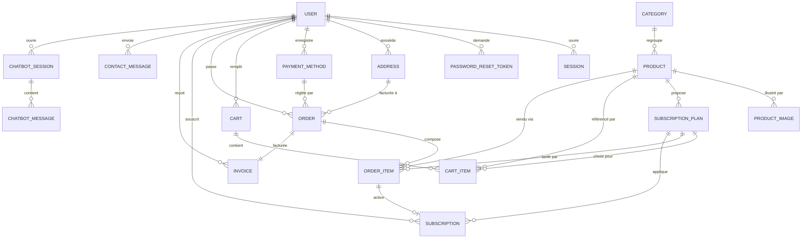
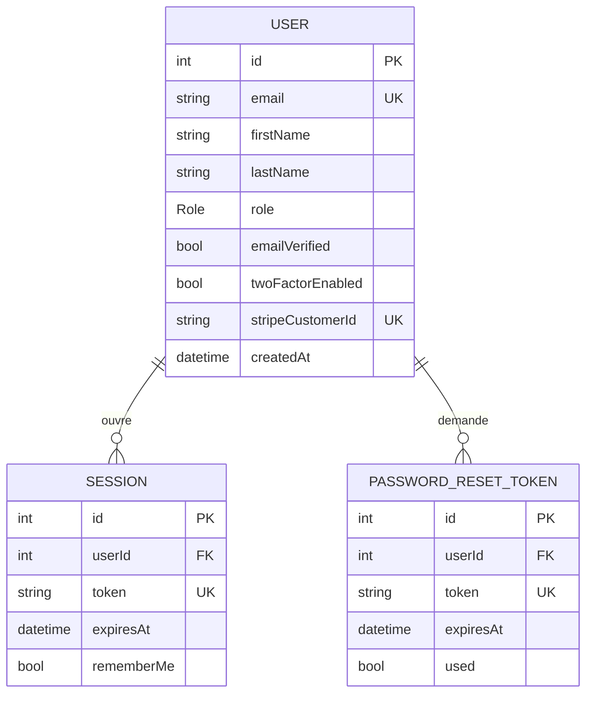
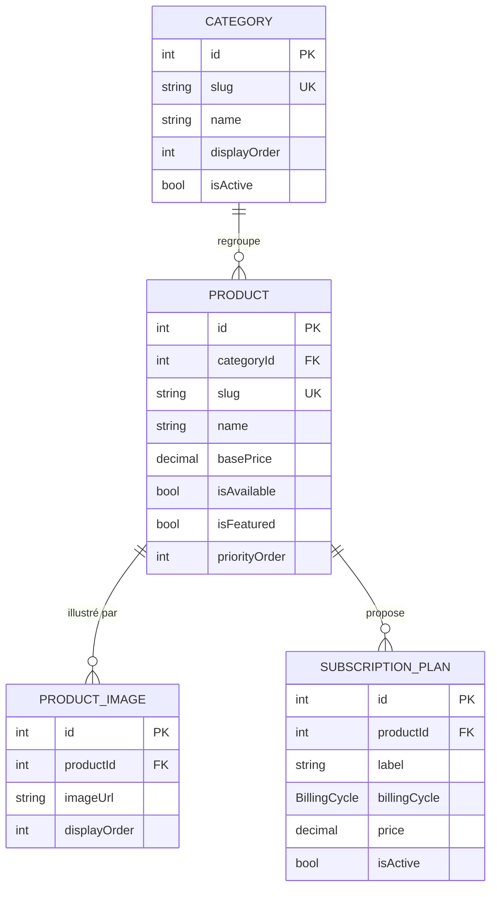
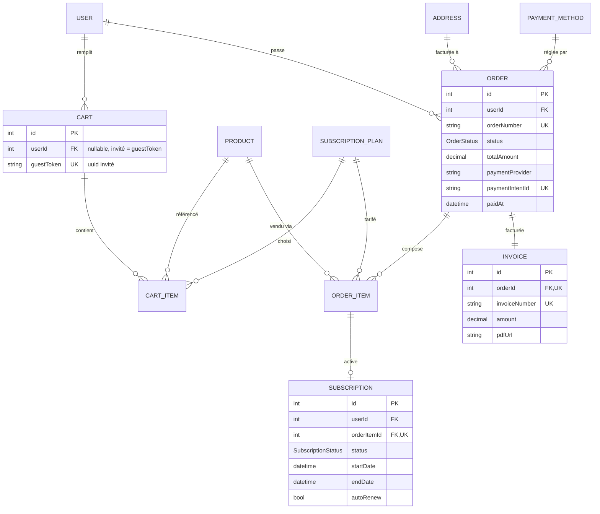
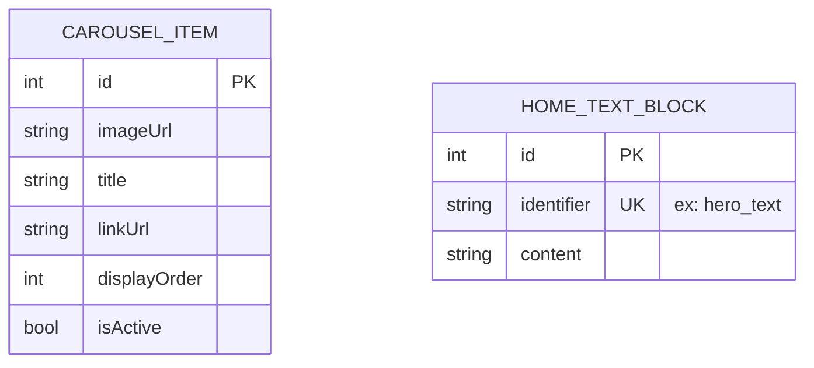
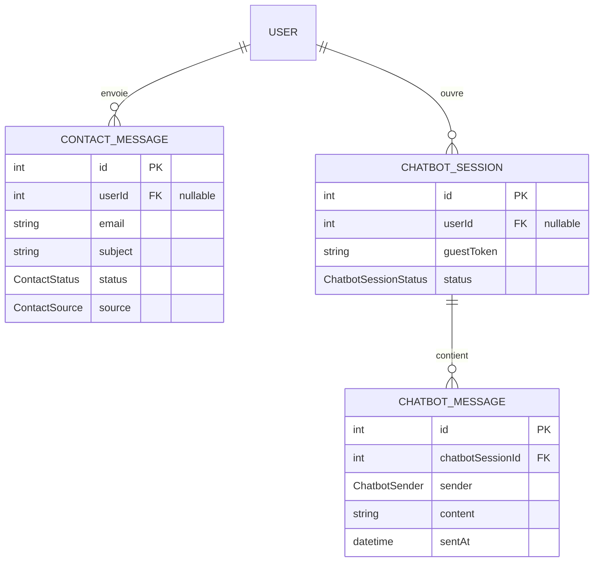

# Modèle de Données — Projet CYNA

**Source :** `cyna-api/prisma/schema.prisma` (19 modèles, 8 énumérations)
**SGBD cible :** PostgreSQL
**ORM :** Prisma

Ce document présente le modèle de données du projet CYNA en deux niveaux :

- **MCD** (Modèle Conceptuel de Données) : entités et relations à un niveau abstrait, indépendant de l'implémentation.
- **MLD** (Modèle Logique de Données) : tables, colonnes typées, clés primaires et étrangères, contraintes, prêt à être traduit en DDL.

Le modèle est organisé en six domaines fonctionnels :

1. **Utilisateurs & Authentification** — comptes, sessions, récupération de mot de passe
2. **Adresses & Moyens de paiement** — coordonnées et instruments financiers
3. **Catalogue** — catégories, produits, plans d'abonnement, images
4. **Page d'accueil** — carrousel et blocs de texte éditables
5. **Panier, Commandes, Abonnements, Factures** — flux d'achat
6. **Contact & Support** — messages de contact et conversations chatbot

---

## 1. MCD — Modèle Conceptuel de Données

Le MCD présente les entités et leurs associations. Les attributs sont limités aux identifiants et aux champs structurants pour la lisibilité.

### 1.1 Vue d'ensemble

**Lecture :** chaque utilisateur (`USER`) peut ouvrir plusieurs sessions, posséder plusieurs adresses, etc. Un produit (`PRODUCT`) appartient à une catégorie unique mais propose plusieurs plans d'abonnement. Une commande (`ORDER`) est liée à exactement une facture (`INVOICE`) et chaque ligne d'une commande peut activer un abonnement.

### 1.2 Domaine — Utilisateurs et authentification

**Notes :**
- Un utilisateur a un `role` (`USER` ou `ADMIN`) qui pilote l'accès au back-office.
- L'authentification à deux facteurs (`twoFactorEnabled`, `twoFactorSecret`) est nativement modélisée (TOTP).
- Une session est invalidée automatiquement quand l'utilisateur est supprimé (cascade).

### 1.3 Domaine — Catalogue

**Notes :**
- Chaque produit appartient à exactement une catégorie (SOC, EDR, XDR pour CYNA).
- Un produit peut proposer plusieurs plans d'abonnement (`MONTHLY`, `YEARLY`, `PER_USER`, `PER_DEVICE`).
- Le `slug` (chaîne URL-safe) est unique au niveau catégorie et produit, pour des URL stables.

### 1.4 Domaine — Panier et commandes

**Notes :**
- Le **panier** supporte les **invités** (`userId` null + `guestToken` uuid) pour permettre un parcours sans compte.
- L'**`OrderItem`** stocke des **snapshots** (`productName`, `planLabel`, `unitPrice`) pour préserver l'historique commercial même si le catalogue change.
- Une **commande** correspond à exactement **une facture** (`Invoice`) ; chaque ligne de commande peut générer **un abonnement** actif s'il s'agit d'un produit récurrent.
- Le `paymentIntentId` est unique pour bloquer les doublons côté Stripe.

### 1.5 Domaine — Page d'accueil

**Notes :**
- Pas de relation : ces deux entités sont **autonomes** et alimentent les blocs éditables de la page d'accueil.
- `HomeTextBlock.identifier` est utilisé comme clé fonctionnelle (`hero_text`, `promo_banner`, etc.).

### 1.6 Domaine — Contact et chatbot

**Notes :**
- Les messages de contact peuvent venir d'un **utilisateur connecté** ou d'un **invité** (`userId` null, e-mail obligatoire).
- Le chatbot supporte le même cas (utilisateur ou invité). Un message a un `sender` (`USER`, `BOT`, `AGENT`) qui permet d'historiser les échanges humains et automatiques.

---

## 2. MLD — Modèle Logique de Données

Le MLD décrit les tables physiques avec types, contraintes et relations. Conventions :

- **PK** = clé primaire
- **FK** = clé étrangère (avec table cible entre parenthèses)
- **UK** = contrainte d'unicité
- Types Prisma traduits en types SQL PostgreSQL standards.

### 2.1 Énumérations

| Enum | Valeurs |
|---|---|
| `Role` | `USER`, `ADMIN` |
| `OrderStatus` | `PENDING`, `PAID`, `ACTIVE`, `CANCELLED`, `REFUNDED` |
| `BillingCycle` | `MONTHLY`, `YEARLY`, `PER_USER`, `PER_DEVICE` |
| `SubscriptionStatus` | `ACTIVE`, `CANCELLED`, `EXPIRED`, `PAUSED` |
| `ContactStatus` | `NEW`, `READ`, `REPLIED`, `CLOSED` |
| `ContactSource` | `FORM`, `CHATBOT` |
| `ChatbotSessionStatus` | `OPEN`, `ESCALATED`, `CLOSED` |
| `ChatbotSender` | `USER`, `BOT`, `AGENT` |

### 2.2 Tables — Utilisateurs et authentification

#### `users`

| Colonne | Type | Contraintes |
|---|---|---|
| `id` | `INT` | PK, auto-increment |
| `stripe_customer_id` | `VARCHAR` | UK, nullable |
| `first_name` | `VARCHAR` | NOT NULL |
| `last_name` | `VARCHAR` | NOT NULL |
| `email` | `VARCHAR` | UK, NOT NULL |
| `password_hash` | `VARCHAR` | NOT NULL |
| `email_verified` | `BOOLEAN` | NOT NULL, default `false` |
| `email_verification_token` | `VARCHAR` | UK, nullable |
| `email_verified_at` | `TIMESTAMP` | nullable |
| `role` | `ENUM(Role)` | NOT NULL, default `USER` |
| `two_factor_enabled` | `BOOLEAN` | NOT NULL, default `false` |
| `two_factor_secret` | `VARCHAR` | nullable |
| `last_login_at` | `TIMESTAMP` | nullable |
| `reset_password_code` | `VARCHAR` | nullable |
| `reset_password_expires` | `TIMESTAMP` | nullable |
| `created_at` | `TIMESTAMP` | NOT NULL, default `NOW()` |
| `updated_at` | `TIMESTAMP` | NOT NULL, auto-updated |

#### `sessions`

| Colonne | Type | Contraintes |
|---|---|---|
| `id` | `INT` | PK, auto-increment |
| `user_id` | `INT` | FK (`users.id`), ON DELETE CASCADE |
| `token` | `VARCHAR` | UK, NOT NULL |
| `remember_me` | `BOOLEAN` | NOT NULL, default `false` |
| `expires_at` | `TIMESTAMP` | NOT NULL |
| `ip_address` | `VARCHAR` | nullable |
| `user_agent` | `VARCHAR` | nullable |
| `created_at` | `TIMESTAMP` | NOT NULL, default `NOW()` |

#### `password_reset_tokens`

| Colonne | Type | Contraintes |
|---|---|---|
| `id` | `INT` | PK, auto-increment |
| `user_id` | `INT` | FK (`users.id`), ON DELETE CASCADE |
| `token` | `VARCHAR` | UK, NOT NULL |
| `expires_at` | `TIMESTAMP` | NOT NULL |
| `used` | `BOOLEAN` | NOT NULL, default `false` |
| `created_at` | `TIMESTAMP` | NOT NULL, default `NOW()` |

### 2.3 Tables — Adresses et paiement

#### `addresses`

| Colonne | Type | Contraintes |
|---|---|---|
| `id` | `INT` | PK, auto-increment |
| `user_id` | `INT` | FK (`users.id`), ON DELETE CASCADE |
| `first_name` | `VARCHAR` | NOT NULL |
| `last_name` | `VARCHAR` | NOT NULL |
| `address_line1` | `VARCHAR` | NOT NULL |
| `address_line2` | `VARCHAR` | nullable |
| `city` | `VARCHAR` | NOT NULL |
| `region` | `VARCHAR` | nullable |
| `postal_code` | `VARCHAR` | NOT NULL |
| `country` | `VARCHAR` | NOT NULL |
| `phone` | `VARCHAR` | nullable |
| `is_default` | `BOOLEAN` | NOT NULL, default `false` |
| `created_at` | `TIMESTAMP` | NOT NULL, default `NOW()` |
| `updated_at` | `TIMESTAMP` | NOT NULL, auto-updated |

#### `payment_methods`

| Colonne | Type | Contraintes |
|---|---|---|
| `id` | `INT` | PK, auto-increment |
| `user_id` | `INT` | FK (`users.id`), ON DELETE CASCADE |
| `provider_token` | `VARCHAR` | NOT NULL — token Stripe / PayPal, jamais brut |
| `card_holder_name` | `VARCHAR` | NOT NULL |
| `last4_digits` | `VARCHAR(4)` | NOT NULL |
| `card_brand` | `VARCHAR` | NOT NULL — `visa`, `mastercard`, `amex`... |
| `exp_month` | `INT` | NOT NULL, 1..12 |
| `exp_year` | `INT` | NOT NULL |
| `is_default` | `BOOLEAN` | NOT NULL, default `false` |
| `created_at` | `TIMESTAMP` | NOT NULL, default `NOW()` |
| `updated_at` | `TIMESTAMP` | NOT NULL, auto-updated |

### 2.4 Tables — Catalogue

#### `categories`

| Colonne | Type | Contraintes |
|---|---|---|
| `id` | `INT` | PK, auto-increment |
| `name` | `VARCHAR` | NOT NULL |
| `slug` | `VARCHAR` | UK, NOT NULL |
| `description` | `TEXT` | nullable |
| `image_url` | `VARCHAR` | nullable |
| `display_order` | `INT` | NOT NULL, default `0` |
| `is_active` | `BOOLEAN` | NOT NULL, default `true` |
| `created_at` | `TIMESTAMP` | NOT NULL, default `NOW()` |
| `updated_at` | `TIMESTAMP` | NOT NULL, auto-updated |

#### `products`

| Colonne | Type | Contraintes |
|---|---|---|
| `id` | `INT` | PK, auto-increment |
| `category_id` | `INT` | FK (`categories.id`) |
| `name` | `VARCHAR` | NOT NULL |
| `slug` | `VARCHAR` | UK, NOT NULL |
| `short_description` | `VARCHAR` | nullable |
| `description` | `TEXT` | nullable |
| `technical_specs` | `TEXT` | nullable |
| `base_price` | `DECIMAL(10,2)` | NOT NULL |
| `is_available` | `BOOLEAN` | NOT NULL, default `true` |
| `is_featured` | `BOOLEAN` | NOT NULL, default `false` |
| `priority_order` | `INT` | NOT NULL, default `0` |
| `created_at` | `TIMESTAMP` | NOT NULL, default `NOW()` |
| `updated_at` | `TIMESTAMP` | NOT NULL, auto-updated |

#### `product_images`

| Colonne | Type | Contraintes |
|---|---|---|
| `id` | `INT` | PK, auto-increment |
| `product_id` | `INT` | FK (`products.id`), ON DELETE CASCADE |
| `image_url` | `VARCHAR` | NOT NULL |
| `display_order` | `INT` | NOT NULL, default `0` |
| `alt_text` | `VARCHAR` | nullable |
| `created_at` | `TIMESTAMP` | NOT NULL, default `NOW()` |

#### `subscription_plans`

| Colonne | Type | Contraintes |
|---|---|---|
| `id` | `INT` | PK, auto-increment |
| `product_id` | `INT` | FK (`products.id`), ON DELETE CASCADE |
| `label` | `VARCHAR` | NOT NULL |
| `billing_cycle` | `ENUM(BillingCycle)` | NOT NULL |
| `price` | `DECIMAL(10,2)` | NOT NULL |
| `is_active` | `BOOLEAN` | NOT NULL, default `true` |
| `created_at` | `TIMESTAMP` | NOT NULL, default `NOW()` |
| `updated_at` | `TIMESTAMP` | NOT NULL, auto-updated |

### 2.5 Tables — Page d'accueil

#### `carousel_items`

| Colonne | Type | Contraintes |
|---|---|---|
| `id` | `INT` | PK, auto-increment |
| `image_url` | `VARCHAR` | NOT NULL |
| `title` | `VARCHAR` | nullable |
| `subtitle` | `VARCHAR` | nullable |
| `link_url` | `VARCHAR` | nullable |
| `display_order` | `INT` | NOT NULL, default `0` |
| `is_active` | `BOOLEAN` | NOT NULL, default `true` |
| `created_at` | `TIMESTAMP` | NOT NULL, default `NOW()` |
| `updated_at` | `TIMESTAMP` | NOT NULL, auto-updated |

#### `home_text_blocks`

| Colonne | Type | Contraintes |
|---|---|---|
| `id` | `INT` | PK, auto-increment |
| `identifier` | `VARCHAR` | UK, NOT NULL |
| `content` | `TEXT` | NOT NULL |
| `updated_at` | `TIMESTAMP` | NOT NULL, auto-updated |

### 2.6 Tables — Panier

#### `carts`

| Colonne | Type | Contraintes |
|---|---|---|
| `id` | `INT` | PK, auto-increment |
| `user_id` | `INT` | FK (`users.id`), nullable, ON DELETE CASCADE |
| `guest_token` | `UUID` | UK, nullable |
| `created_at` | `TIMESTAMP` | NOT NULL, default `NOW()` |
| `updated_at` | `TIMESTAMP` | NOT NULL, auto-updated |

**Contrainte applicative :** un panier a `user_id` OU `guest_token` non null (pas les deux à la fois). À enforcer par CHECK SQL ou en couche métier.

#### `cart_items`

| Colonne | Type | Contraintes |
|---|---|---|
| `id` | `INT` | PK, auto-increment |
| `cart_id` | `INT` | FK (`carts.id`), ON DELETE CASCADE |
| `product_id` | `INT` | FK (`products.id`) |
| `subscription_plan_id` | `INT` | FK (`subscription_plans.id`) |
| `quantity` | `INT` | NOT NULL, default `1`, > 0 |
| `unit_price` | `DECIMAL(10,2)` | NOT NULL — snapshot au moment de l'ajout |
| `created_at` | `TIMESTAMP` | NOT NULL, default `NOW()` |
| `updated_at` | `TIMESTAMP` | NOT NULL, auto-updated |

### 2.7 Tables — Commandes

#### `orders`

| Colonne | Type | Contraintes |
|---|---|---|
| `id` | `INT` | PK, auto-increment |
| `user_id` | `INT` | FK (`users.id`) |
| `billing_address_id` | `INT` | FK (`addresses.id`) |
| `payment_method_id` | `INT` | FK (`payment_methods.id`) |
| `order_number` | `VARCHAR` | UK, NOT NULL |
| `status` | `ENUM(OrderStatus)` | NOT NULL, default `PENDING` |
| `subtotal` | `DECIMAL(10,2)` | NOT NULL |
| `tax_amount` | `DECIMAL(10,2)` | NOT NULL, default `0` |
| `total_amount` | `DECIMAL(10,2)` | NOT NULL |
| `payment_provider` | `VARCHAR` | nullable — `stripe` ou `paypal` |
| `payment_intent_id` | `VARCHAR` | UK, nullable |
| `paid_at` | `TIMESTAMP` | nullable |
| `created_at` | `TIMESTAMP` | NOT NULL, default `NOW()` |
| `updated_at` | `TIMESTAMP` | NOT NULL, auto-updated |

#### `order_items`

| Colonne | Type | Contraintes |
|---|---|---|
| `id` | `INT` | PK, auto-increment |
| `order_id` | `INT` | FK (`orders.id`), ON DELETE CASCADE |
| `product_id` | `INT` | FK (`products.id`) |
| `subscription_plan_id` | `INT` | FK (`subscription_plans.id`) |
| `product_name` | `VARCHAR` | NOT NULL — snapshot |
| `plan_label` | `VARCHAR` | NOT NULL — snapshot |
| `quantity` | `INT` | NOT NULL, > 0 |
| `unit_price` | `DECIMAL(10,2)` | NOT NULL |
| `total_price` | `DECIMAL(10,2)` | NOT NULL |
| `created_at` | `TIMESTAMP` | NOT NULL, default `NOW()` |

### 2.8 Tables — Abonnements et factures

#### `subscriptions`

| Colonne | Type | Contraintes |
|---|---|---|
| `id` | `INT` | PK, auto-increment |
| `user_id` | `INT` | FK (`users.id`) |
| `order_item_id` | `INT` | FK (`order_items.id`), UK |
| `product_id` | `INT` | FK (`products.id`) |
| `subscription_plan_id` | `INT` | FK (`subscription_plans.id`) |
| `status` | `ENUM(SubscriptionStatus)` | NOT NULL, default `ACTIVE` |
| `start_date` | `TIMESTAMP` | NOT NULL |
| `end_date` | `TIMESTAMP` | NOT NULL |
| `next_renewal_date` | `TIMESTAMP` | nullable |
| `auto_renew` | `BOOLEAN` | NOT NULL, default `true` |
| `cancelled_at` | `TIMESTAMP` | nullable |
| `cancellation_reason` | `TEXT` | nullable |
| `created_at` | `TIMESTAMP` | NOT NULL, default `NOW()` |
| `updated_at` | `TIMESTAMP` | NOT NULL, auto-updated |

#### `invoices`

| Colonne | Type | Contraintes |
|---|---|---|
| `id` | `INT` | PK, auto-increment |
| `order_id` | `INT` | FK (`orders.id`), UK |
| `user_id` | `INT` | FK (`users.id`) |
| `invoice_number` | `VARCHAR` | UK, NOT NULL |
| `pdf_url` | `VARCHAR` | nullable |
| `amount` | `DECIMAL(10,2)` | NOT NULL |
| `issued_at` | `TIMESTAMP` | NOT NULL, default `NOW()` |
| `created_at` | `TIMESTAMP` | NOT NULL, default `NOW()` |

### 2.9 Tables — Contact et chatbot

#### `contact_messages`

| Colonne | Type | Contraintes |
|---|---|---|
| `id` | `INT` | PK, auto-increment |
| `user_id` | `INT` | FK (`users.id`), nullable, ON DELETE SET NULL |
| `email` | `VARCHAR` | NOT NULL |
| `subject` | `VARCHAR` | NOT NULL |
| `message` | `TEXT` | NOT NULL |
| `status` | `ENUM(ContactStatus)` | NOT NULL, default `NEW` |
| `source` | `ENUM(ContactSource)` | NOT NULL, default `FORM` |
| `created_at` | `TIMESTAMP` | NOT NULL, default `NOW()` |
| `updated_at` | `TIMESTAMP` | NOT NULL, auto-updated |

#### `chatbot_sessions`

| Colonne | Type | Contraintes |
|---|---|---|
| `id` | `INT` | PK, auto-increment |
| `user_id` | `INT` | FK (`users.id`), nullable, ON DELETE SET NULL |
| `guest_token` | `VARCHAR` | nullable |
| `status` | `ENUM(ChatbotSessionStatus)` | NOT NULL, default `OPEN` |
| `created_at` | `TIMESTAMP` | NOT NULL, default `NOW()` |
| `updated_at` | `TIMESTAMP` | NOT NULL, auto-updated |

#### `chatbot_messages`

| Colonne | Type | Contraintes |
|---|---|---|
| `id` | `INT` | PK, auto-increment |
| `chatbot_session_id` | `INT` | FK (`chatbot_sessions.id`), ON DELETE CASCADE |
| `sender` | `ENUM(ChatbotSender)` | NOT NULL |
| `content` | `TEXT` | NOT NULL |
| `sent_at` | `TIMESTAMP` | NOT NULL, default `NOW()` |

---

## 3. Synthèse — Choix de modélisation

Les principaux choix qui méritent d'être justifiés dans le DAT :

### 3.1 Snapshots dans `order_items` et `cart_items`

`product_name`, `plan_label`, `unit_price` sont **dupliqués** dans les lignes de panier et de commande au moment de la création. Justification : une commande passée en mars doit conserver le **prix et le nom du produit à l'époque**, même si le catalogue évolue. Sans ce snapshot, modifier un produit casserait l'historique commercial.

### 3.2 Support des invités (panier et chatbot)

`Cart.userId` et `ChatbotSession.userId` sont **nullables**, complétés par un `guestToken` UUID. Ce choix permet à un visiteur non connecté d'**ajouter au panier** ou de **dialoguer avec le chatbot** sans inscription préalable, et de récupérer son contexte au login (migration côté API).

### 3.3 Couplage commande / facture / abonnement

Une commande génère exactement **une** facture (`Order ↔ Invoice` en 1-1). Une ligne de commande peut générer **un** abonnement actif (`OrderItem ↔ Subscription` en 1-0..1). Cette structure permet de distinguer clairement **achat one-shot** (sans abonnement) et **achat récurrent** (avec abonnement actif).

### 3.4 Sécurité des moyens de paiement

`PaymentMethod` ne stocke **aucune donnée brute** (PAN, CVV interdits par PCI-DSS). Seul le **token du fournisseur** (Stripe/PayPal) est conservé, accompagné des métadonnées d'affichage (`last4Digits`, `cardBrand`, `expMonth`, `expYear`).

### 3.5 Authentification à deux facteurs

`User.twoFactorEnabled` et `User.twoFactorSecret` sont nativement modélisés. Le secret TOTP est stocké chiffré côté application (pas en clair). Cohérent avec le contexte CYNA : plateforme de cybersécurité, donc **exigence implicite d'exemplarité**.

### 3.6 Cascades et préservation d'historique

| Relation | Comportement | Pourquoi |
|---|---|---|
| `User → Sessions` | CASCADE | Sessions n'ont aucun sens sans utilisateur |
| `User → Cart` | CASCADE | Panier non finalisé peut disparaître |
| `User → ContactMessage` | SET NULL | On garde l'historique support après suppression |
| `User → ChatbotSession` | SET NULL | Idem |
| `Order → OrderItem` | CASCADE | Cohérence transactionnelle |
| `Order → Invoice` | (non défini ici) | À sécuriser : **conservation comptable légale** (10 ans) |

**Point d'attention DAT :** la **conservation des factures** (`Invoice`) doit être garantie même si la commande ou l'utilisateur est supprimé, pour des raisons légales (obligations comptables françaises). À documenter et possiblement modifier en CASCADE → SET NULL côté `Invoice.userId` et `Invoice.orderId`.

### 3.7 Champs unique et index implicites

Tous les champs marqués `@unique` dans Prisma génèrent un **index B-tree unique** côté PostgreSQL. À documenter dans le DAT pour la section **performance / scalabilité** :

- `users.email`, `users.stripe_customer_id`, `users.email_verification_token`
- `sessions.token`, `password_reset_tokens.token`
- `categories.slug`, `products.slug`
- `orders.order_number`, `orders.payment_intent_id`
- `invoices.invoice_number`, `invoices.order_id`
- `subscriptions.order_item_id`
- `carts.guest_token`, `home_text_blocks.identifier`

**Recommandation pour la performance** : ajouter des index secondaires sur les colonnes fréquemment filtrées (`products.category_id`, `products.is_featured`, `orders.user_id`, `orders.status`, `subscriptions.user_id`, `subscriptions.status`, `contact_messages.status`) et un index trigramme (`pg_trgm`) sur `products.name` et `products.short_description` pour la recherche plein-texte.

---

*Document généré à partir de `cyna-api/prisma/schema.prisma` le 2026-05-10. À mettre à jour si le schéma évolue.*
